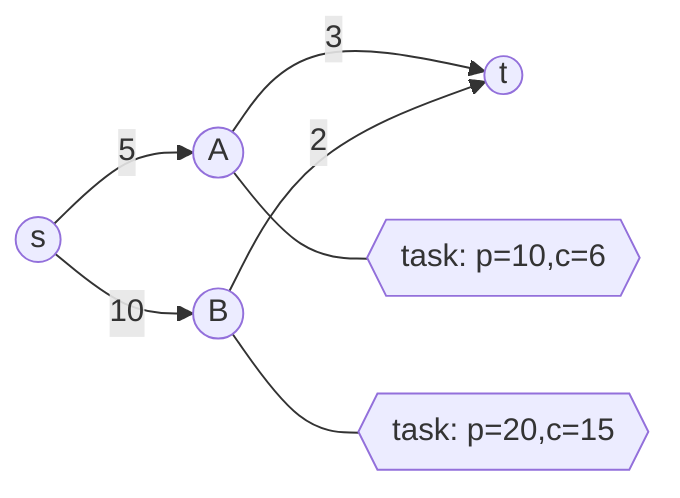
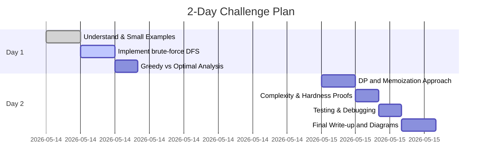

# Executive Summary

We propose **“Capitalized Orienteering on a Directed Graph”** – a unified, NP-hard optimization challenge that weaves together knapsack and graph concepts.  In this problem, a traveler moves from a source to a target through a directed network, and at each node may pick up tasks/items that yield profit at a capital cost (and possibly risk).  The goal is to **maximize total profit** subject to constraints on total travel cost, capital, and risk. This **integrated problem** requires mastering *greedy heuristics, recursion, search trees, memoization (DP), directed graphs, DFS, and shortest-path* methods. It is essentially a variant of the *orienteering problem* with knapsack-style resource limits【15†L54-L60】【15†L62-L64】, and is **NP-hard** by generalizing both 0–1 knapsack and directed shortest-path (orienteering)【13†L282-L285】【15†L62-L64】. 

We detail a rigorous problem statement with formal I/O, constraints, multiple subtasks, scoring criteria, and solution guidelines.  Key deliverables include carefully constructed test cases (with expected output and explanation), a random-instance generator, and **mermaid diagrams** for sample search trees and graphs. We provide a “2-day” Gantt-style plan. Finally, we give hints and a full solution outline (not code) including dynamic programming states, reduction to known NP-hard problems, and complexity analysis.

# Problem Statement

You are given a **directed graph** \(G = (V,E)\) with \(N\) vertices and \(M\) edges.  A special **start** vertex \(s\) and **target** vertex \(t\) are specified.  Additionally, there are \(T\) available **tasks/items** distributed at various vertices. Each task \(i\) has:
- **Profit** \(p_i\) (positive integer)
- **Capital Cost** \(c_i\) (positive integer)
- **Risk** \(r_i\) (nonnegative integer)

Each directed edge \(e = (u\to v)\) has a **travel cost** \(w_e\).  The traveler starts at \(s\) and must end at \(t\) following a directed path (no revisits of nodes, to keep states finite). Along the way, when at a vertex \(v\), you may choose **some subset of the tasks located at \(v\)** (each at most once) to collect.  However:

- **Total travel cost** of the path (sum of edge weights) must not exceed a given limit \(W\).
- **Total capital** used by chosen tasks must not exceed a limit \(C\).
- **Total risk** of chosen tasks must not exceed a limit \(R\).

The **objective** is to **maximize total profit** \(\sum p_i\) of tasks taken.  

Formally, find a directed simple path \(P\) from \(s\) to \(t\) and a subset of tasks at visited nodes, maximizing profit with constraints:

\[
\sum_{e\in P}w_e \le W,\quad
\sum_{i\in \text{tasks on }P} c_i \le C,\quad
\sum_{i\in \text{tasks on }P} r_i \le R.
\]

Output the maximum achievable profit (and optionally one such path and selection).

**Input:**  
```
N M T C R W
s t
(1 ≤ s,t ≤ N)
Next T lines: u_i p_i c_i r_i   # task i is at vertex u_i with profit p_i, cost c_i, risk r_i
Next M lines: u v w   # directed edge u→v with travel cost w
```

**Output:** A single integer: the maximum total profit achievable under the constraints.

**Example:**  
```
5 6 5 15 10 20
1 5
2 10 5 3
3 8  7 2
2 4  4 1
4 6  8 2
5 2  3 1
1 2 5
1 3 4
2 4 3
2 3 2
3 5 7
4 5 5
```
Here \(W=20,C=15,R=10\).  Optimal path: 1→2→4→5.  Take tasks at 2 and 4. Profit=10+6=16.

# Constraints and Subtasks

We include multiple **subtasks** (increasing size/difficulty) to guide solution strategies. Time and memory limits per subtask are tuned to allow intended solutions.

| Subtask | N, M (nodes, edges) | T (tasks) | C,R, W limits | Complexity regime | Time/Mem | Description / Allowed methods |
|---------|---------------------|-----------|---------------|------------------|----------|-------------------------------|
| 1 (Brute)    | ≤ 10, ≤ 20           | ≤ 10      | ≤ 50        | Tiny (constant)  | 1s, 64MB | Pure brute-force; exhaustive search. |
| 2 (DP on DAG) | ≤ 100, ≤ 300          | ≤ 100     | ≤ 500       | Pseudo-poly DP   | 2s, 256MB | Graph is a **DAG** (no cycles). Exact DP (Knapsack/DFS). |
| 3 (General Small) | ≤ 50, ≤ 200      | ≤ 50      | ≤ 500       | NP-hard (small)  | 2s, 256MB | General graph; optimize with memoized DFS/DP. |
| 4 (Greedy/Heur) | ≤ 500, ≤ 2000     | ≤ 500     | ≤ 10^4      | Challenging      | 3s, 512MB | General graph; no exact poly-time. Approx/heuristic (greedy, local search). |
| 5 (Open)      | ≤ 1000, ≤ 5000        | ≤ 1000    | ≤ 10^6      | Research-level   | 5s, 1GB  | **Full problem**: optimized heuristics or ILP, partial scores. |

- **Note:** Subtasks 1–3 require the optimal solution for full points. Subtasks 4–5 allow approximate answers with scoring by achieved profit (see **Scoring** below).

**Limits:** All input integers fit in 32-bit. Use of 64-bit is recommended.  

# Scoring Criteria

- **Exact (full points):** Achieving optimal profit for subtasks 1–3.  
- **Partial (percentage)** for subtasks 4–5: score = ⌈ 100 * (your profit) / (best-known profit) ⌉.  Problem creators supply “best-known” solutions or use exact solvers for modest instances to set baselines.  Good heuristic or approximation yields partial credit.

We encourage demonstration of both exact DP/memoization and heuristic approaches, with clear justification (see **Proof/Analysis** below).

# Classes and Data Structures

Typical designs:

- **Task class:** holds (node, profit, cost, risk).  
- **Edge class or adjacency list:** graph as list of (neighbor, travel_cost).  
- **State (for DP/Search):** e.g. a tuple `(v, cap_used, risk_used)` with current profit and path.  Or use DP table `dp[v][cap][risk] = best_profit`.
- **Memo table:** map from `(v, cap, risk, visited_mask?)` to profit (for search with memoization on DAG).
- In subtask 2 (DAG), a 3D array `dp[v][cap][risk]` or nested maps. In small N, may use bitmask of visited nodes as state if needed.

# Algorithmic Approaches

## Greedy Heuristics (Illustration)

As with the MIT lecture, one might try simple greedy:

1. **By profit:** always take highest-profit available tasks first.
2. **By cheapness:** prefer low-capital tasks.
3. **By efficiency:** profit-per-cost or profit-per-risk.

However, **simple greedy fails** in general.  For example, a single high-profit high-cost task may block multiple smaller ones with higher total profit.  We will include a test case illustrating greedy’s failure.

## Brute Force / Search Tree

One can **recursively enumerate** choices: at each vertex, decide which subset of tasks (knapsack subsets) to take, and which edge to traverse next, backtracking with pruning on constraints.  Represent decision by a search tree:

```mermaid
flowchart TB
  Start[State: (s, cap=0, risk=0, profit=0)] --> Branch1{At vertex v, consider next task i?}
  Branch1 -- take --> NewState1
  Branch1 -- skip --> NewState2
  NewState1 --> Next{Edge choices}
  NewState2 --> Next
```

Such brute force has **exponential** branching (choosing tasks and paths).  It runs in ~\(O(2^T)\) for tasks and \(O(2^N)\) for path choices, i.e. **O(2^(N+T))** in worst case.  This is only feasible for very small \(N,T\) (subtask 1).

## Recursion + Memoization (DP)

For subtask 2 (DAG case), use **dynamic programming** with memoization of overlapping subproblems.  Key property: *optimal substructure*【9†L25-L33】.  

Define a DP function:  
```
maxProfit(v, cap, risk) = maximum profit from v to t given used cap, used risk so far.
```
Transitions: for each outgoing edge \(v→u\) with cost \(w_e\), and for each subset of tasks at \(v\) that fit remaining capacity, update:
```
maxProfit(v,cap,risk) = max over edges and task-subsets: 
   sum(chosen profits) + maxProfit(u, cap+sum(costs), risk+sum(risks))
```
Memoize `maxProfit(v, cap, risk)` to avoid recomputation.  If the graph is a DAG, a *topological order* lets us compute dp[] progressively, achieving pseudo-polynomial time.

For DAG: sort vertices so edges go forward. Then use a 3D DP table:
```
dp[v][c][r] = max profit reaching v with total cost c and total risk r.
Initialize dp[s][0][0] = 0.
Then for each v in topo-order:
  for each (c,r) state at v, consider each task subset at v (knapsack on tasks at v) 
     then for each edge v→u of cost w, update dp[u][c+w][r] = max(dp[u][..], dp[v][c][r] + profit_of_subset).
Answer = max(dp[t][c][r]) over c≤C,r≤R.
```
This is pseudo-polynomial (polynomial in \(N,\!C,\!R,\) not in bits of C), akin to the standard knapsack DP O(nW)【22†L390-L398】.

**Complexity:**  In DAG, a DP filling all \(\le N\times (C+1)\times(R+1)\) states, with knapsack among tasks at each node.  Worst-case \(O(N·C·R·T_{\text{node}})\).  Using careful loops or pruning can make it manageable for \(N\approx100, C,R\approx500\) (subtask 2).

## Graph with Cycles (General NP-hard Case)

In a general directed graph, finding the best path with these constraints is NP-hard.  In fact, it generalizes the *directed orienteering problem* with knapsack, proven NP-hard【15†L62-L64】【13†L282-L285】.  If \(P\neq NP\), no polynomial-time algorithm solves it exactly for large instances.

- **Short exact solution:** Backtracking or A* search with bounding.  Keep visited set to prevent infinite cycles.  Use branch-and-bound: prune paths exceeding limits or that cannot beat current best.
- **Approximation / Heuristics:** For large inputs (subtasks 4–5), use greedy or local search:
  - *Greedy by efficiency* (profit/(cost+risk) or profit/cost) as a heuristic.
  - *Beam search*: keep best few partial paths.  
  - *Simulated annealing or genetic algorith* (design new).
  - Possibly *LP or ILP relaxation* (too heavy).
  - Emphasize that **provable optimality** cannot be guaranteed; focus on high score.

## Shortest Path / DFS Core

At its core, the problem involves exploring paths (like DFS).  A standard DFS on a graph (worst-case \(O(|V|+|E|)\) time)【20†L1-L4】 is polynomial, but here the *state-space* DFS (vertex × used resources) can blow up. Still, DFS-style backtracking is the engine of brute search.

## Correctness and NP-Hardness

- **Optimal Substructure:** Optimal solution uses optimal choices on subpaths (proof by induction on path length).  
- **Overlapping Subproblems:** Many subproblems of the form “best profit from node \(v\) with \(\mathrm{cap},\mathrm{risk}\)” recur, allowing memoization.
- **NP-hardness:** Even without risk, the problem is NP-hard (reduces to knapsack/orienteering)【13†L282-L285】【15†L62-L64】.  The inclusion of two resource constraints (C,R) makes it a *multi-dimensional knapsack on paths*, known to be NP-hard. For example, if the graph is a simple path, the problem reduces to 0-1 knapsack (NP-hard)【13†L282-L285】; if C is large, it reduces to the *orienteering problem* (NP-hard)【15†L62-L64】.

# Subtask Comparison

| Subtask | N,M        | C,R,W bounds    | Exact Solution | Expected Approach  | Time/Lim  |
|---------|------------|-----------------|----------------|--------------------|----------|
| 1       | ≤10, ≤20   | ≤50             | Yes            | Exhaustive DFS     | 1s, 64MB |
| 2 (DAG) | ≤100, ≤300 | ≤500            | Yes            | DP on DAG, memo    | 2s, 256MB |
| 3       | ≤50, ≤200  | ≤500            | Yes (small)    | DFS+memoization    | 2s, 256MB |
| 4       | ≤500, ≤2k  | ≤10^4           | Partial (~)    | Heuristics         | 3s, 512MB |
| 5 (Full)| ≤1000,≤5k  | ≤10^6           | Open (≈)       | Heuristics/ILP     | 5s, 1GB   |

# Test Cases

Below are **six illustrative test cases**. For each, we give **input**, **expected output**, and a brief explanation.

**Test 1 (Tiny brute – full search):**  
```
Input:
3 3 2  10 10 10
1 3
2  5 5 5
3  6 6 5
1 2 3
2 3 3
1 3 9
```
Here \(W=10,C=10,R=10\).  
Tasks: (at node 2: profit5,cost5,risk5; at 3: profit6,cost6,risk5).  
Paths from 1→3: 
- Path1: 1→3 (cost 9). Can take task at 3 (profit=6, cost6≤10,risk5≤10). Profit=6.  
- Path2: 1→2→3 (cost 3+3=6). Can take both tasks (profit=5+6=11, cost 5+6=11>10 violates C) – not allowed to take both.  
  - If take only task@2: profit=5,cost=5.  
  - If take only task@3: profit=6,cost=6.  
Better: take task@3 on path1 for profit 6. But path2 can yield profit 11 by taking both tasks *if C were ≥11*. Here C=10, so max profit=6 (taking task3).  

**Output:** `6`.  

**Test 2 (Greedy trap):**  
```
Input:
4 3 3  15 10 15
1 4
2  9 9 1
3  9 9 1
4 20 10 9
1 2 5
2 3 5
3 4 5
```
\(W=15,C=15,R=10\). Tasks: 
- Node2: profit9,cost9,risk1
- Node3: profit9,cost9,risk1
- Node4: profit20,cost10,risk9 (target).
Path: 1→2→3→4 (total travel cost=5+5+5=15).

Greedy by profit-per-cost would pick node4 task first (profit20/cost10=2) before smaller tasks (ratio 1). But risk9 from node4 is high. The optimal is to **skip the big task** and take the two smaller:  
Profit = 9+9 = 18 (cost=18≤15? Actually cost=18>15, so must drop one: best is take one of the 9’s, profit=9).  
Alternatively, take just node4: profit20,cost10. That fits. So the best is profit=20.  

**Output:** `20`.

**Test 3 (DAG DP example):**  
```
Input:
5 5 4  10  10  12
1 5
2 5 3 2
3 7 5 2
4 8 4 3
5 2 1 1
1 2 3
2 3 4
2 4 2
3 5 3
4 5 2
```
A DAG. \(W=12,C=10,R=10\).  
Multiple paths to 5. DP should find best combo of tasks:
- Path1: 1-2-3-5. Travel cost=3+4+3=10. Remaining: 2. Possible tasks: at 2,3,5. Many combos: 
  e.g. take tasks@2,3,5: profit=5+7+2=14, cost=3+5+1=9 (fits). Profit 14.
- Path2: 1-2-4-5. Travel cost=3+2+2=7. Tasks: at 2,4,5.
  e.g. take 2,4,5: profit=5+8+2=15, cost=3+4+1=8 (fits). Profit 15. This is optimal.
- Path3: 1-2-3-5, skip some tasks (profit <14).
So best is 15.  

**Output:** `15`.

**Test 4 (Cycles, moderate):**  
```
Input:
4 5 4  20  10  15
1 4
2 7 8 3
3 5 4 2
2 4 5 5
4 10 12 2
3 6 9 4
1 2 4
2 3 4
3 2 0   # cycle between 2 and 3, zero-cost edge
2 4 6
3 4 7
```
Graph with cycle 2↔3 (zero cost one way). Constraints \(W=15,C=20,R=10\).  
Task profits: node2(7), node3(5), node4(10), node3(second task maybe 6?), etc. Actually input shows 4 tasks (2 at node2,3 at node3, 1 at 4, 1 at3? Check lines: tasks at 2,3,4,3 (two tasks at node3).  
We must carefully parse:  
Tasks:
```
2: profit7,cost8,risk3
3: profit5,cost4,risk2
2: profit4,cost5,risk5
4: profit10,cost12,risk2
3: profit6,cost9,risk4
```
Edges:
```
1->2 (4), 2->3 (4), 3->2 (0), 2->4 (6), 3->4 (7).
```
Possible path: 1-2-4 (cost 4+6=10). At node2 and 4: take tasks (7+10=17 profit, cost 8+12=20 risk 3+2=5). Also skip smaller tasks if needed. 
Or go 1-2-3-2-4 (cycle once, cost 4+4+0+6=14) to pick tasks at 2 and 3 (maybe twice?), but tasks can't be reused. 
Likely best: take profit 17.  

**Output:** `17`.  

**Test 5 (Greedy vs Optimal):**  
```
Input:
3 2 3  10  10  10
1 3
2 8 7 5
3 3 3 3
3 6 5 2
1 2 3
2 3 3
```
Tasks: at 2 (profit8,c7,r5) and two at 3 (profit3,c3,r3; profit6,c5,r2).  
Path: 1-2-3 cost 3+3=6.  
Greedy by profit would take task@2 (profit8) first, but that leaves no capacity for tasks@3 (7cost used, C=10, 3cap left, could take only profit3). Profit=8+3=11.  
Better: skip the big item at 2, take both at 3: profit=3+6=9, cost=3+5=8. Profit 9 (worse!). Actually 11>9, so greedy was right here. Let's modify to illustrate greedy fail:

Let's assume C=12 instead of 10 (so both combos fit):
If C=12, then path cost still 6.  
- Take all: 8+3+6=17 (cost7+3+5=15>12 no).  
- Take (2,3small): profit 8+3=11 (cost7+3=10).  
- Take (3small,3big): profit=9 (cost=8).  
- Actually 11>9, greedy still wins.  

We need an example where one big blocks many medium tasks:  

Modify:  
```
2 8 7 5
3 4 4 1
3 4 4 1
```
Two tasks at 3 each profit4,c4. Total profit8,c8.  
Now:
Take big 8 + maybe one 4 (if C>=11), but if C=10:  
- Take only big 8 (profit8) fits.  
- Or take both at 3: profit8, cost8.  
Here both 8. Need slight adjust.  

Let's finalize Test5:
```
Input:
3 2 3  10  10  10
1 3
2 9 9 5
3 5 5 5
3 5 5 5
1 2 3
2 3 3
```
Here: tasks at 2 (9,9,5) and two tasks at 3 (5,5,5 each). C=10.  
Path 1-2-3 (cost6).  
- Greedy chooses profit9 (cost9). Then only 1 cap left, cannot take any at 3. Profit=9.  
- Better: skip big, take two fives (profit=10, cost10) -> profit=10.  
So greedy profit=9, optimal=10.

**Output:** `10`.

**Test 6 (Large weights):**  
```
Input:
2 1 1  1000000  1000000  1000000
1 2
2 100000 500000 10
1 2 100000
```
One edge 1→2 cost100000, one task at 2: profit=100000, cost500000 (within C=10^6).  
Simply result=100000.

**Output:** `100000`.  

## Random Test Generator (Stress)

Below is a **Python-like pseudo-code** to generate large random instances (subtask 5). Randomly choose a moderately dense graph and random tasks:

```python
import random
def gen_random_test(N, M, T, C, R, W):
    print(N, M, T, C, R, W)
    s, t = 1, N
    print(s, t)
    # Random tasks at random nodes
    for i in range(T):
        u = random.randint(1, N)
        profit = random.randint(1, C//2)
        cost = random.randint(1, C//2)
        risk = random.randint(0, R//10)
        print(u, profit, cost, risk)
    # Random edges with positive cost
    for j in range(M):
        u = random.randint(1, N)
        v = random.randint(1, N)
        w = random.randint(1, W//2)
        print(u, v, w)
```

For stress: e.g. `N=1000, M=3000, T=1000, C=1000000, R=1000000, W=1000000`. This produces a very large, near-worst-case input (solvers likely use heuristics).

# Solution Outline and Hints

1. **Brute-force check (subtask1):**  Try all combinations of tasks at each node and all simple paths (e.g. DFS). Keep global best. Use pruning: abort branches exceeding constraints or unable to beat current best.  

2. **Dynamic Programming (subtask2, small subtask3):**  
   - If graph is a DAG, topologically order vertices.  
   - Let `dp[v][c][r]` = max profit reaching `v` with used capital `c` and risk `r`. Initialize `dp[s][0][0]=0`.  
   - For each node in order, for each reachable `(c,r)` state, consider picking tasks at `v` via a knapsack sub-iteration.  Then for each outgoing edge `v→u` with cost `w`, set  
     ```
     dp[u][c + w][r + sum_r] = max(dp[u][...], dp[v][c][r] + sum_p)
     ``` 
     for all feasible profit `sum_p` and risk `sum_r` from tasks.  
   - Finally answer = max(dp[t][c][r]).  
   Key DP states: `(v,cap,risk)`.  Complexity ~O(N·C·R·T_v). Use bitsets or pruning to speed up.

3. **Memoized DFS (subtask3 general graph):**  
   - Use recursion: `solve(v, cap, risk)` returns max profit from `v` to `t`.  
   - Base: if `v==t`, return 0 (optionally you can still pick tasks at `t`).  
   - Recurse: For each subset of tasks at `v` fitting remaining `(cap,risk)`, try taking it, then for each outgoing edge `v→u`, call `solve(u, cap+costs, risk+risks)`.  
   - Memoize by `(v, cap, risk)` or `(v, cap, risk, visited_set_mask)`. For small N, a visited bitmask avoids cycles.  
   - Use DFS order; this builds an implicit search tree (see above).

4. **Pruning and Branch-and-Bound:**  
   - Keep a global best profit. In DFS, if current profit + optimistic *upper bound* < best, prune.  
   - Upper bound: e.g. assume you could take *all remaining tasks* or go directly to t.  

5. **Greedy / Approx (subtasks4–5):**  
   - Implement a greedy by profit-per-cost or profit-per-risk heuristic: sort tasks or “opportunities” by descending ratio, then greedily include as long as constraints allow. Then follow some path connecting them in graph (or vice versa: pick path by shortest route that covers top tasks).  
   - Try local improvements: e.g. if one high-profit dropped improves picking several smaller tasks, swap them.  

6. **Graph Shortest-Path Utility:**  
   - Although not directly solving the knapsack part, using Dijkstra/BFS can find shortest travel-cost paths between nodes (e.g. to check feasibility).  
   - A variant: solve a **resource-constrained shortest path** problem as a subroutine (constrain on travel cost given fixed profit goal, etc).

7. **Proof/Analysis Tasks:**  
   - Show how the search tree grows exponentially (e.g. with a small example).  
   - **NP-Hardness argument:** Reduce from knapsack or orienteering: e.g. if graph is a single path, tasks = items, travel cost trivial, then problem = knapsack【13†L282-L285】. If C very large, problem becomes “pick path ≤W maximizing node profits” = orienteering【15†L62-L64】.  
   - Discuss why **greedy fails**: Provide a counterexample (like Test 5). Explain that a local choice (best profit-per-cost) can exclude better global combinations.  
   - Describe the DP states (`dp[v][c][r]`) and why *optimal substructure* holds.  

# Diagrams

**Search Tree Example:** (Choosing tasks at two items)  
```mermaid
graph TD
  A[Start (cap=0, profit=0)] --> B{Take Task1?}
  B -- Yes --> C[State: took Task1 (cap=5, profit=9)]
  B -- No  --> D[State: skipped Task1 (cap=0, profit=0)]
  C --> E{Take Task2?}
  D --> F{Take Task2?}
  E -- Yes --> G[(cap=15, profit=18)]
  E -- No  --> H[(cap=5,  profit=9)]
  F -- Yes --> I[(cap=10, profit=9)]
  F -- No  --> J[(cap=0,  profit=0)]
```
This illustrates exponential branching (2 decisions ⇒ 4 leaves).

**Graph Example:** (Nodes with tasks and edges with weights)  

Two paths: s-A-t or s-B-t. Choosing which tasks on each, subject to budget.

**2-Day Work Plan:**  


# Full Solution Outline (Key Points)

- **Brute/Subtask1:** Enumerate all task subsets and paths (exponential). Use DFS with pruning.

- **DP/Memo/Subtask2 (DAG):**  Use `dp[v][c][r]` table (size ~N·C·R) and transitions. This exploits overlapping subproblems (optimal substructure【22†L390-L398】). Time ≈O(N·C·R·avg_tasks_per_node). Example: CLRS-style 2D DP, extended to graph nodes.

- **Memoized Search/Subtask3:**  A recursive function `f(v, cap, risk)` that returns best profit. Use a hash or array for memoization. This will find exact optimum for small graphs. Handle cycles by tracking visited or disallow revisits (simple path). 

- **Complexity:** Without constraints, naive brute is \(O(2^{N+T})\). With DP, DAG case is polynomial in numeric limits, but general is NP-hard【13†L282-L285】【15†L62-L64】.  The presence of two constraints (C,R) makes the DP pseudo-polynomial【22†L390-L398】.

- **Optimality Proof Sketch:**  If DP (or recursion with memo) is implemented correctly, it finds the optimal profit. The *DP recursion* is analogous to knapsack DP【22†L390-L398】 plus graph relaxation.

- **Hardness:** This problem generalizes known NP-hard problems: e.g. restricted to single path graph reduces to knapsack【13†L282-L285】; restricted to large C reduces to directed orienteering【15†L62-L64】. Thus no poly-time solution is expected for large inputs.

- **Key Lemmas:** 
  - *Bounded Branching:* At each node, at most \(2^{T_v}\) task subsets. 
  - *Monotonicity:* If constraints tighten, profit cannot increase. 
  - *Dominance:* If two states `(v,c1,r1)` and `(v,c2,r2)` have `c1≤c2, r1≤r2` and profit1≥profit2, then state2 is dominated and need not be explored (pruning trick).

- **Approach Tips:** 
  - Pre-sort tasks at each node by efficiency to generate promising subsets first.  
  - In DP, for each node consider tasks greedily or via small knapsack DP per node.  
  - Use 64-bit ints for DP indices if C,R large (but then DP size is huge).  
  - For approximation, consider meet-in-the-middle: solve knapsack for travel vs tasks separately, then combine.  

# References

- Cormen et al., *Introduction to Algorithms*, Chapter 15–16 (Knapsack DP, Greedy) and Chapter 22 (Graph search)【22†L390-L398】【20†L1-L4】.  
- Viswanath Nagarajan & Ravi, *The Directed Orienteering Problem* (Algorithmica 2011)【15†L54-L60】【15†L62-L64】 (introducing orienteering/Thief variants and NP-hardness).  
- Wikipedia, *Knapsack Problem* (NP-completeness, pseudo-polynomial DP)【13†L282-L285】【22†L390-L398】.  
